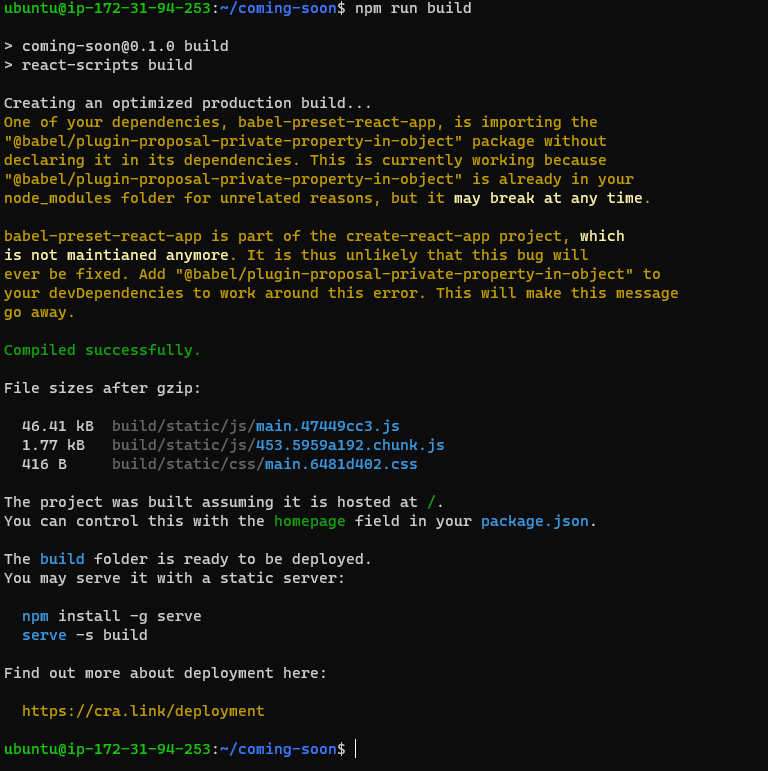

# AWS EC2 App Deployment with Nginx Server

Deploy React Application on AWS EC2 Ubuntu Server With Nginx, Domain and SSL Setup.

**Launch an AWS EC2 Ubuntu Server**

- Log in to the AWS Management Console.
- Navigate to the EC2 Dashboard.
- Click on “Launch Instance” and choose ubuntu as your virtual machine.
- Generate keypairs for SSH connection

**Connecting to the EC2 Instance**

- Use your preferred SSH terminal to connect to the EC2 instance.
    - For example, if you’re on  windows, you can use the Terminal app
    - Go to key pair directory and then open the terminal
    - Run this command

```bash
ssh -i filename.pem ubuntu@ec2-public-ip
```

- Update ubuntu

```bash
sudo apt update && sudo apt upgrade -y
```

- Install git

```bash
sudo apt install git -y
```

- Install Node.js and npm (if your project requires them)

While installing the node Js  set the version of node js to same as your project node version(setup_16.x)

```bash
curl -fsSL https://deb.nodesource.com/setup_16.x | sudo -E bash -
sudo apt install -y nodejs
```

- Install Nginx as a reverse proxy server

```bash
sudo apt install nginx -y
```

- **Clone Your GitHub Repository**

```bash
sudo git clone https://github.com/username/repo-name.git
```

- Move into the project directory

```bash

cd repo-name
```

### Set Up Your Application (Only If Your App Requires npm)

1. Install the dependencies:
    
    ```bash
    npm install
    ```
    
2. Create a build 

```bash
npm run build
```

⚠️ ERROR
 npm  WARN  EBADENGINE  Unsupported engine

 npm ERR ! code EACCES

The errors you’re seeing are due to two main issues:

1. **Node version mismatch**: Your project requires Node.js version 18 or higher, but your instance has Node.js version 16 installed.
2. **Permissions issue**: The user doesn’t have permission to write to the `node_modules` directory.

Here’s how to fix both issues.

### Step 1: Update Node.js to Version 18

1. Remove the current Node.js version:
    
    ```bash
    sudo apt remove nodejs -y
    ```
    
2. Install Node.js version as per project (setup_18.x) by adding the NodeSource repository:
    
    ```bash
    curl -fsSL https://deb.nodesource.com/setup_18.x | sudo -E bash -
    sudo apt install -y nodejs
    ```
    
3. Confirm the update:You should see a version of Node.js 18.x.
    
    ```bash
    node -v
    ```
    

### Step 2: Fix Permissions

Since the project directory might have been created by a different user or with root privileges, we need to ensure the `ubuntu` user has permission to write to it.

1. Change the ownership of the project directory to the `ubuntu` user:

To verify the ownership of your `~/repo-` directory after running the `chown` command, you can use the `ls -ld` command:

1. Run the following command:
    
    ```bash
    
    ls -ld ~/repo-name
    ```
    
2. This command will display the ownership and permissions of the `repo-name` directory. You should see something like this:
    
    ```yaml
    
    drwxrwxr-x 5 ubuntu ubuntu 4096 Oct 25 10:30 repo-name
    ```
    
    In this output:
    
    - The first part (`drwxrwxr-x`) shows the permissions.
    - The second part (`ubuntu ubuntu`) confirms that the directory is owned by the `ubuntu` user and group.
    - 

Change the ownership of the project directory to the `ubuntu` user:

```bash

sudo chown -R ubuntu:ubuntu ~/repo-name
```

### Step 3: Install Project Dependencies

Now that the permissions are set correctly and Node.js is updated, try installing the dependencies again.

1. Run:
    
    ```bash
    
    npm install
    ```
    

### Step 4: Build the Project

After the dependencies are installed, you can build the project:

```bash
npm run build
```

These steps should resolve the issues.

- **After Build - output would be like**



- Go too root directory by `cd`  and create a directory for build

```bash
sudo mkdir -p /var/www/vhosts/frontend/
```

- Go to project repo directory

```bash
cd repo-name
```

- Now run this command to copy the `build` folder from project directory to new created build directory

```bash
sudo cp -R build/ /var/www/vhosts/frontend/
```

- Go to root directory by `cd`  enter

**Create Nginx File**

With this command, you can check if already a default nginx file exists. You have to remove it.

```bash
cd /etc/nginx/sites-enabled/
ls
sudo rm -rf default
```

- Create a configuration file for Nginx using the following command:
    
    ```bash
    sudo vim /etc/nginx/sites-available/<nginx-file-name>
    ```
    
- Paste the provided server configuration inside the file created.
    
    ```bash
    server {
      listen 80 default_server;
      server_name _;
    
      location / {
          autoindex on;
          root /var/www/vhosts/frontend/build;
          try_files $uri /index.html;
        }
    }
    ```
    

To save this vim file type `:wq` and press enter.

- Activate the configuration using the following command:

```bash
sudo ln -s /etc/nginx/sites-available/<nginx-file-name> /etc/nginx/sites-enabled/
```

**Start the Application**

- Restart Nginx and allow the changes to take place.
    
    ```bash
    sudo systemctl restart nginx
    sudo service nginx restart
    ```
    

• Additionally, in case of errors, you can check error logs and status.

```bash
sudo nginx -t
```

**Domain and SSL setup**

**Domain**

First, you have to Public IP address or ec2 instance as An R3cord of your domain, it can be on any domain provider like GoDaddy. You can also watch the video.

**SSL Setup**

```bash
sudo apt-get install certbot python3-certbot-nginx
sudo certbot --nginx -d <domain-name>
sudo systemctl reload nginx
```

### Set Up the Application to Run in the Background

Use a process manager like `pm2` to keep your application running after closing the terminal.

1. Install `pm2` globally:
    
    ```bash
    sudo npm install -g pm2
    ```
    
2. Start your application with `pm2`:
    
    ```bash
    
    pm2 start npm -- start
    ```
    
3. Set `pm2` to start on system reboot:
    
    ```bash
    pm2 startup
    pm2 save
    ```
    

### Access Your Application

Open your browser and go to `http://ec2-public-ip`. You should see your application running via Nginx.

**PM2 is a Production Process Manager for Node.js applications**
with a built-in Load Balancer.

```bash
        Start and Daemonize any application:
        $ pm2 start app.js

        Load Balance 4 instances of api.js:
        $ pm2 start api.js -i 4

        Monitor in production:
        $ pm2 monitor

        Make pm2 auto-boot at server restart:
        $ pm2 startup

```